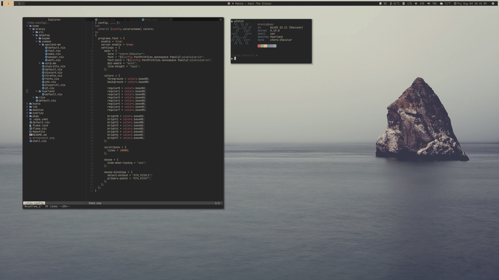

# ❄️ Nix Configuration

[](https://builtwithnix.org)

My NixOS and home-manager configuration files. Heavily based and inspired by
[misterio77's nix-config](https://github.com/misterio77/nix-config). Many thanks
for the work he has contributed.

## Screenshot



## Organization

| Dir/File  | Description                                                 |
| --------- | ----------------------------------------------------------- |
| home      | Application-specific components (aka dotfiles)              |
| hosts     | NixOS configurations                                        |
| modules   | Various modules to make life easier when configuring things |
| overlay   | Patches and version overrides for some packages             |
| pkgs      | Nix packages                                                |
| flake.nix | Flake configuration which ties everything together          |

## About the installation

All systems use a single btrfs partition, with subvolumes for `/nix`, a
`/persist` directory (which is opt-in using `impermanence`), and a root
subvolume (cleared on every boot).

## My install process

This may not be the most optimal way to install, but it is what I have found
which works.

First, download and boot the official
[NixOS ISO](https://nixos.org/download.html#nixos-iso) or
[Netboot.xyz](https://netboot.xyz/downloads/)

Install git

```sh
nix-env -i git
```

Clone this repo

```sh
git clone https://github.com/brenix/nix-config
```

Enter a development shell

```sh
nix --extra-experimental-features "nix-command flakes" develop
```

Format and mount the partitions

```sh
sudo make volumes HOSTNAME=<hostname> DISK=/dev/<disk>
```

Copy the livecd host keys to the persistence dir

```sh
sudo make host-keys
sudo mkdir -p /mnt/persist/etc/ssh && cp /etc/ssh/ssh_host\* /mnt/persist/etc/ssh
```

Update the `.sops.yaml` with the age pubkey obtained using the following command
on another nix host

```sh
nix-shell -p ssh-to-age --run 'ssh-keyscan <ip/hostname> | ssh-to-age'
```

Re-encrypt with the new keys

```sh
sops updatekeys -y path/to/secrets.yaml
```

Install

```sh
sudo -E nixos-install --impure --no-root-passwd --flake .#<hostname>
```
